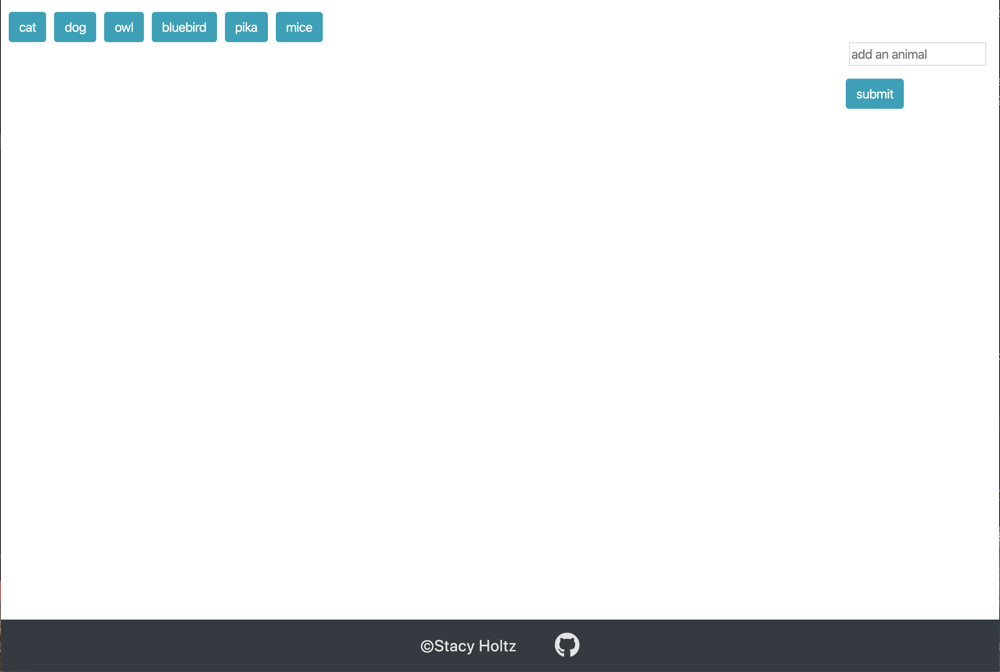
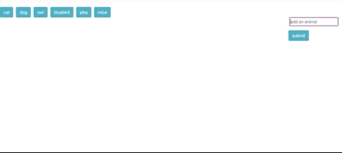

# GifTastic

### Link to live game:
[Gif Tastic](https://stacyholtz6.github.io/GifTastic/)

## Overview:
```
--- When a button is clicked gifs related to that topic are loaded to the page.
--- The gifs are "still" and when the user clicks the gif it becomes animated. The gif can be toggled between animated and still by clicking on it. 
--- More gif buttons can be added to the page by typing in a topic in the add animal input box and clicking submit.
--- When submit is click the button will be added to the top of the page with the rest of the buttons. 
--- The new button can be clicked to add gifs related to that topic. 

```

## Tools/Languages Used:
```
--- Gify API
--- Javascript
--- JQuery
--- Bootstrap
--- Flexbox
--- Font Awesome
--- HTML/CSS
```

## Features:
```
Preloaded buttons are on the page. These buttons are added dynamically added through javascript. 
```


```
When a user clicks a button still gifs are added to the page
```


```
When a user clicks on the gif it becomes animated. Click it again and it becomes still.
```


```
Type a topic in the input field and click submit. The new button is added to the top of the page and the new gifs function the same way. 
```
